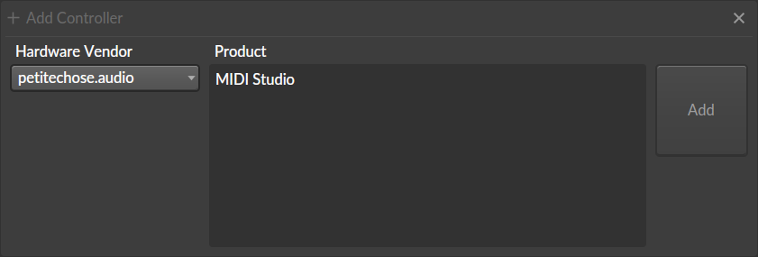

# MIDI Studio - Bitwig Plugin

Bitwig Studio extension with Teensy 4.1 hardware controller for advanced DAW control.

## Overview

MIDI Studio connects Bitwig with custom hardware:

- **Bitwig Extension**: Java plugin using Bitwig Extension API v25
- **Teensy Firmware**: C++ embedded application with LVGL interface
- **SysEx Protocol**: Type-safe auto-generated communication layer

### Key Features

- Transport control (Play, Stop, Record)
- Device/track navigation with visual feedback
- 8 encoder macro control (Remote Controls)
- ILI9341 display with custom LVGL interface
- Real-time Host ↔ Device synchronization

## Prerequisites

### Host Development

#### Windows
```powershell
# OpenJDK 25
winget install Microsoft.OpenJDK.25

# Maven
winget install Apache.Maven
```

#### Linux (Fedora/RHEL)
```bash
# OpenJDK 25
sudo dnf install java-25-openjdk.x86_64

# Maven
sudo dnf install maven
```

#### Linux (Ubuntu/Debian)
```bash
# OpenJDK 25
sudo apt update
sudo apt install openjdk-25-jdk

# Maven
sudo apt install maven
```

#### Verify Installation
```bash
java -version   # Should show OpenJDK 25
mvn -version    # Should show Maven 3.9+
```

### Device Development

See [Core README](https://github.com/petitechose-midi-studio/core#prerequisites) for:
- **PlatformIO** installation
- **Python 3.11+** with **uv**
- **Teensy board support**

Quick summary:
```bash
# Python + uv
pip install uv

# PlatformIO (recommended via VS Code extension)
# Or: pip install platformio
```

### Hardware

See [Core README](https://github.com/petitechose-midi-studio/core#hardware) for hardware requirements (Teensy 4.1, display, encoders, etc.)

### Bitwig Studio

- **Bitwig Studio 6 Beta**: Currently in development for Bitwig 6
  - Uses latest API features (text value lists, etc.)
  - Bitwig 5 backport may be considered if needed

## Project Structure

```
plugin-bitwig/
├── host/src/               # Bitwig Extension (Java)
│   ├── midistudio/         # Main extension code
│   ├── handler/            # Message handlers
│   │   ├── controller/     # Hardware → Bitwig
│   │   └── host/           # Bitwig → Hardware
│   ├── protocol/           # Generated protocol (package: protocol)
│   └── util/               # Utilities
│
├── src/                    # Teensy Firmware (C++)
│   ├── main.cpp            # Entry point
│   ├── handler/            # Protocol handlers
│   ├── protocol/           # Generated protocol (namespace: Protocol)
│   └── ui/                 # LVGL interface
│
├── protocol/               # Protocol Definitions (Python)
│   ├── message/            # Message definitions
│   ├── field/              # Field definitions
│   ├── plugin_paths.py     # Output configuration
│   └── sysex_protocol_config.py
│
└── script/bash/            # Build & generation scripts
    ├── extension/          # Java build scripts
    └── protocol/           # Protocol generator
```

## Quick Start

### Install dependencies

```bash
# Python
uv sync

# PlatformIO
pio lib install
```

### Build Extension

```bash
./script/bash/extension/bitwig-package.sh
# or
cd host && mvn package
```

Extension is auto-deployed to:
- **Windows**: `%USERPROFILE%\Documents\Bitwig Studio\Extensions`
- **macOS**: `~/Documents/Bitwig Studio/Extensions`
- **Linux**: `~/Bitwig Studio/Extensions`

### Build & Upload Firmware

```bash
# Production
pio run -e prod -t upload

# Debug (with logs)
pio run -e debug -t upload
pio device monitor
```

### Activate in Bitwig

1. Settings → Controllers → Add controller
2. Search "petitechose.audio" vendor and select "MIDI Studio"

   

3. Configure MIDI ports (Input/Output)

   

4. Extension shows "MIDI Studio : Connected"

## Development

### Architecture

```
Bitwig Studio (API)
        ↕ MIDI SysEx
Protocol Layer (C++)
        ↕
    Handlers
        ↕
   UI (LVGL)
```

**Handler Pattern**: Fire-and-forget
- Handlers register with Bitwig API and stay alive via API references
- Extension doesn't hold references (avoids memory leaks)

**Separation**:
- `handler/controller/`: Device → Bitwig commands
- `handler/host/`: Bitwig → Device observations

### Add New Message

1. Define in `protocol/message/`:
```python
class MyMessage(Message):
    message_id: int = 0x42
    value: int
```

2. Generate code:
```bash
./script/bash/protocol/generate_protocol.sh
```

3. Implement handlers (Java & C++):
```java
protocol.onMyMessage = msg -> device.setSomething(msg.value);
```
```cpp
protocol.onMyMessage = [](const MyMessage& msg) { /* ... */ };
```

### Debugging

**Bitwig logs**: `~/Documents/Bitwig Studio/log/BitwigStudio.log`

**Teensy logs**:
```bash
pio run -e debug -t upload
pio device monitor
```

### Build Scripts

```bash
# Extension
./script/bash/extension/bitwig-compile.sh   # Compile only
./script/bash/extension/bitwig-package.sh   # Build & deploy
./script/bash/extension/bitwig-clean.sh     # Clean

# Protocol
./script/bash/protocol/generate_protocol.sh # Regenerate messages
```

## Guidelines

### Commits

Follow [Conventional Commits](https://www.conventionalcommits.org/):

```
feat: add device bypass toggle
fix: correct parameter scaling
refactor: simplify host initialization
docs: update README
chore: upgrade to Java 25
```

### Code Style

**Java**: Google Java Style, 3 spaces (Bitwig convention), max 120 chars

**C++**: C++17, PascalCase classes, camelCase methods, 4 spaces

## Troubleshooting

### Extension not in Bitwig

```bash
# Check deployment
ls ~/Documents/Bitwig\ Studio/Extensions/

# Check logs
tail -f ~/Documents/Bitwig\ Studio/log/BitwigStudio.log

# Rebuild
cd host && mvn clean package
```

### "Unsupported class file major version"

Check Java version: `java -version`

### No Host ↔ Device communication

1. Check MIDI ports in Bitwig Settings
2. Check device logs: `pio device monitor`
3. Regenerate protocol: `./script/bash/protocol/generate_protocol.sh`
4. Rebuild both: `mvn package && pio run -e prod -t upload`

### Maven "Guice/Unsafe" warnings

Already handled in scripts via:
```bash
export MAVEN_OPTS="--sun-misc-unsafe-memory-access=allow"
```

## Resources

- [Bitwig Extension API](https://github.com/bitwig/bitwig-extensions)
- [PlatformIO Teensy](https://docs.platformio.org/en/latest/platforms/teensy.html)
- [LVGL Documentation](https://docs.lvgl.io/)
- [DrivenByMoss](https://github.com/git-moss/DrivenByMoss) - Reference extension framework

---

**Status**: Active development for Bitwig 6
**Version**: 0.1.0 (Alpha)
**Author**: Petitechose Audio

## Icon Font System

Custom icons are generated as a font for efficient rendering with LVGL.

### Workflow

```
asset/icon/*.svg → asset/font/bitwig_icons.ttf → src/ui/font/data/bitwig_icons_14.*
```

### Generate Icons

```bash
# 1. Generate TTF font from SVGs
bash script/font/generate_bitwig_icons.sh

# 2. Convert to LVGL binary format
bash script/lvgl/font/convert_font.sh
```

### Use in Code

```cpp
#include "ui/font/bitwig_icons.hpp"

lv_label_set_text(label, BitwigIcon::TRANSPORT_PLAY);
```

See [script/font/README.md](script/font/README.md) for details.
